# RH-UTCP Architecture

## Overview

RH-UTCP implements the Universal Tool Calling Protocol (UTCP) to enable AI agents to directly interact with corporate tools without middleware overhead. This document describes the system architecture, design decisions, and implementation details.

## System Architecture



### Key Components

1. **AI Agents**: External clients (Cursor, other AI tools) that need to access corporate tools
2. **UTCP Discovery Server**: Provides tool definitions at `/utcp` endpoint
3. **Tool Manual**: JSON specification describing available tools and how to call them
4. **Corporate APIs**: Existing enterprise systems (Jira, Wiki, GitLab, etc.)

### Data Flow

1. AI agents discover available tools by calling the `/utcp` endpoint
2. Discovery server returns a UTCP manual with tool definitions
3. AI agents use the manual to make direct API calls to corporate tools
4. No further interaction with the discovery server is needed

## Design Principles

### 1. Direct API Access
- Tools are called directly, not through a middleware layer
- Reduces latency and complexity
- Leverages existing infrastructure

### 2. Protocol Agnostic
- Supports multiple protocols: HTTP, gRPC, GraphQL, WebSocket
- Tools can use their native communication methods
- Extensible to future protocols

### 3. Security First
- Credentials stored as environment variables
- HTTPS enforced for non-localhost connections
- Supports multiple authentication methods

## Project Structure

```
rh-utcp/
├── cmd/
│   └── server/
│       └── main.go          # Discovery server entry point
├── internal/
│   ├── providers/
│   │   ├── wiki/           # Wiki provider implementation
│   │   ├── jira/           # Jira provider implementation
│   │   └── gitlab/         # GitLab provider implementation
│   ├── auth/               # Authentication helpers
│   └── config/             # Configuration management
├── pkg/
│   └── utcp/               # UTCP manual builder utilities
├── examples/               # Example configurations and usage
├── config/
│   └── providers.yaml      # Provider configuration
└── arch1.svg              # Architecture diagram
```

## Provider Architecture

### Base Provider Interface
Each provider implements a common interface:

```go
type Provider interface {
    GetTools() []utcp.Tool
}
```

### Tool Definition Structure
```json
{
  "name": "tool_name",
  "description": "What this tool does",
  "inputs": {
    "type": "object",
    "properties": {...},
    "required": [...]
  },
  "outputs": {
    "type": "object",
    "properties": {...}
  },
  "tool_provider": {
    "provider_type": "http",
    "url": "https://api.example.com/endpoint",
    "auth": {...}
  }
}
```

## Authentication

### Supported Methods

1. **API Key**
   - Header, query parameter, or cookie placement
   - Environment variable substitution

2. **Basic Authentication**
   - Username/password pairs
   - Base64 encoded in Authorization header

3. **OAuth2**
   - Client credentials flow
   - Token refresh handling

4. **Personal Access Tokens**
   - GitLab, GitHub style tokens
   - Bearer token authentication

### Variable Substitution
- Use `$VAR_NAME` or `${VAR_NAME}` in configurations
- Values pulled from environment at runtime
- Keeps credentials out of code

## Provider Implementations

### Jira Provider
- **Base URL**: Configured via `JIRA_BASE_URL`
- **Auth**: Basic auth with username/password
- **API Version**: REST API v2
- **Tools**: Search, create, update issues; manage projects

### Wiki Provider (Planned)
- **Supported**: Confluence, MediaWiki
- **Auth**: API key or OAuth2
- **Features**: Page CRUD, search, attachments

### GitLab Provider (Planned)
- **API Version**: v4
- **Auth**: Personal access tokens
- **Features**: Projects, MRs, code search, CI/CD

## Deployment Architecture

### Local Development
```bash
go run cmd/server/main.go
# or
make run
```

### Container Deployment
```dockerfile
FROM golang:1.21-alpine AS builder
# Build stage...

FROM alpine:latest
# Runtime stage...
```

### Kubernetes/OpenShift
- ConfigMaps for non-sensitive configuration
- Secrets for credentials
- Service for load balancing
- Horizontal pod autoscaling

## Performance Considerations

### Caching Strategy
- Tool definitions cached in memory
- Optional Redis for distributed caching
- Cache invalidation on configuration changes

### Connection Pooling
- HTTP client connection reuse
- Database connection pooling
- Rate limiting per provider

### Scalability
- Stateless discovery server
- Horizontal scaling supported
- Load balancer friendly

## Security Architecture

### Network Security
- TLS 1.2+ for all external connections
- Certificate validation
- Network policies in Kubernetes

### Authentication Flow
1. Client requests tool discovery
2. Server returns tool definitions with auth placeholders
3. Client substitutes credentials from environment
4. Direct API calls include proper authentication

### Audit Logging
- All discovery requests logged
- No credential logging
- Structured logging for analysis

## Monitoring and Observability

### Metrics
- Prometheus format metrics
- Discovery request count
- Provider availability
- Response times

### Health Checks
- `/health` endpoint
- Provider connectivity checks
- Database connection status

### Logging
- Structured JSON logs
- Log levels: DEBUG, INFO, WARN, ERROR
- Correlation IDs for request tracking

## Future Enhancements

### Streaming Support
- Server-Sent Events (SSE) for real-time updates
- WebSocket for bidirectional communication
- gRPC streaming for high-performance scenarios

### Advanced Authentication
- Kerberos/GSSAPI for enterprise SSO
- SAML integration
- Certificate-based authentication

### Tool Discovery
- OpenAPI specification import
- Automatic tool generation
- GraphQL introspection support

## Development Workflow

### Adding a New Provider
1. Create package in `internal/providers/`
2. Implement `Provider` interface
3. Define tool specifications
4. Add configuration handling
5. Register in discovery server
6. Write tests

### Testing Strategy
- Unit tests for each provider
- Integration tests with mock servers
- End-to-end tests with real APIs (optional)
- Load testing for performance

### CI/CD Pipeline
1. Code commit triggers build
2. Run tests and linting
3. Build container image
4. Deploy to staging
5. Run integration tests
6. Promote to production

## Configuration Management

### Environment Variables
```bash
# Server
PORT=8080

# Jira
JIRA_BASE_URL=https://jira.company.com
JIRA_USERNAME=user
JIRA_PASSWORD=pass

# Wiki
WIKI_BASE_URL=https://wiki.company.com
WIKI_API_KEY=key

# GitLab
GITLAB_BASE_URL=https://gitlab.company.com
GITLAB_TOKEN=token
```

### Provider Configuration
```yaml
providers:
  - name: jira
    type: jira
    enabled: true
    base_url: ${JIRA_BASE_URL}
    
  - name: wiki
    type: confluence
    enabled: true
    base_url: ${WIKI_BASE_URL}
```

## Error Handling

### Client Errors
- 400: Bad request (invalid parameters)
- 401: Authentication required
- 403: Forbidden (insufficient permissions)
- 404: Tool not found

### Server Errors
- 500: Internal server error
- 502: Bad gateway (provider unavailable)
- 503: Service unavailable
- 504: Gateway timeout

### Error Response Format
```json
{
  "error": {
    "code": "PROVIDER_UNAVAILABLE",
    "message": "Unable to connect to Jira",
    "details": {...}
  }
}
```

## Conclusion

RH-UTCP provides a clean, scalable architecture for exposing corporate tools to AI agents. By following UTCP principles, we eliminate middleware overhead while maintaining security and flexibility. The modular design allows easy addition of new providers and protocols as needs evolve. 